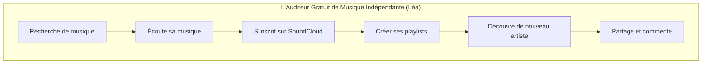
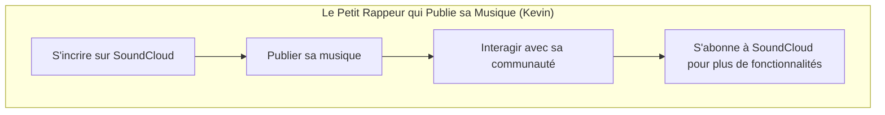
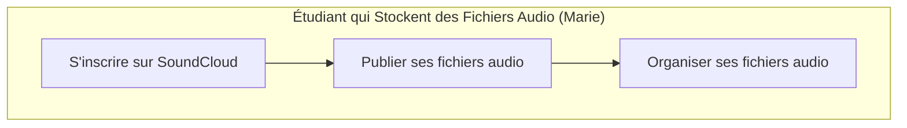

# Gestion de projet

## Parcours utilisateur

```mermaid
graph
%% Persona 1 : L'Auditeur Gratuit de Musique Indépendante (Léa)
subgraph Persona1["L'Auditeur Gratuit de Musique Indépendante (Léa)"]

    P1R[Recherche de musique] --> P1E[Écoute sa musique]
    P1E --> P1I[S'inscrit sur SoundCloud]
    P1I --> P1O[Créer ses playlists]
    P1O --> P1D[Découvre de nouveau artiste]
    P1D--> P1P[Partage et commente]

end
```

```mermaid
graph
%% Persona 2 : Le Petit Rappeur qui Publie sa Musique (Kevin)
subgraph Persona2["Le Petit Rappeur qui Publie sa Musique (Kevin)"]

  P2I[S'incrire sur SoundCloud] --> P2P[Publier sa musique]
  P2P -->  P2In[Interagir avec sa communauté]
  P2In --> P2S[S'abonne à SoundCloud pour plus de fonctionnalités]

end
```

```mermaid
graph
%% Persona 3 : Étudiant qui Stockent des Fichiers Audio (Marie)
subgraph Persona3["Étudiant qui Stockent des Fichiers Audio (Marie)"]

  P3I[S'inscrire sur SoundCloud] --> P3P[Publier ses fichiers audio]
  P3P --> P3O[Organiser ses fichiers audio]

end
```
